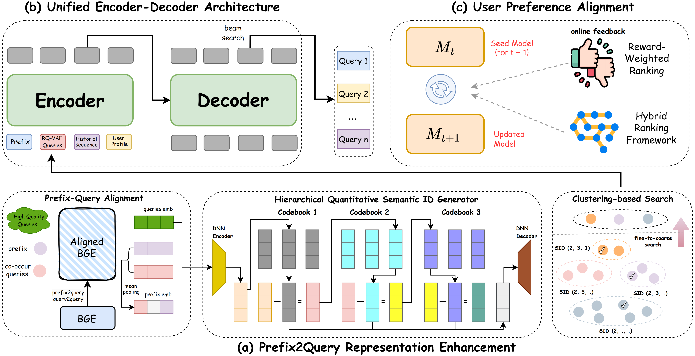

OneSug: The Unified End-to-End Generative Framework for E-commerce Query Suggestion
====================================

Overall structure of the OneSug.

This is a PyTorch implementation for [OneSug: The Unified End-to-End Generative Framework for E-commerce Query Suggestion](https://www.arxiv.org/pdf/2506.06913).

Data
----------------------
We have given 10 anonymized training data samples in `data.txt`. Each sample contains 7 columns: prefix, searched_query, rqvae_query, chosen_sample, reject_sample, pos_score, neg_score.

Train
----------------------
Because OneSug has been applied online, the code is company confidential. Therefore, we make the training pseudocode public in `main.py` to help researchers better understand and reproduce our paper. 
